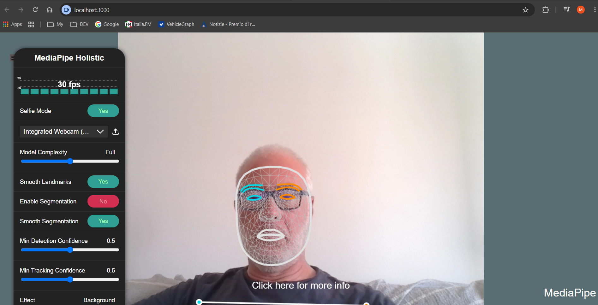

# ComputerVisionMediapipe

Demo basata su [mediapipe-js-demos](https://github.com/pjbelo/mediapipe-js-demos).



## Setup

```bash
npm init -y
npm install express
npm install @mediapipe/tasks-vision
```

## Avvio

```bash
node app.js
```
